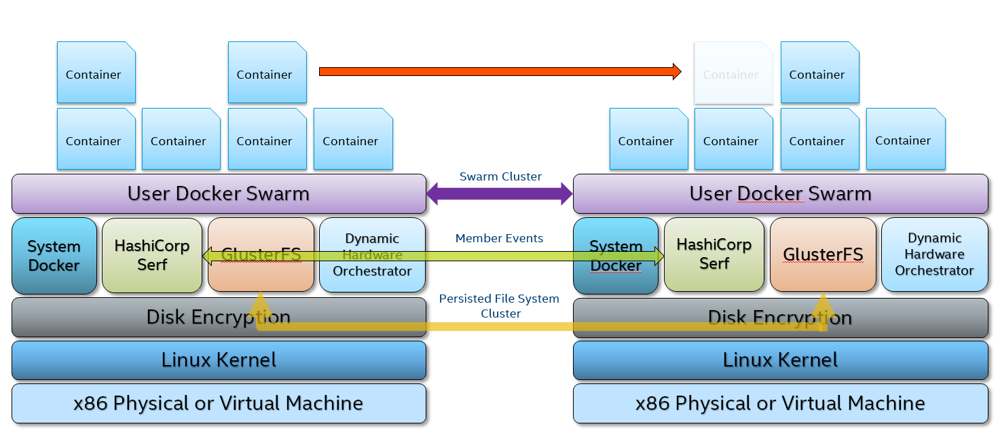

# Retail Workload Orchestrator (RWO)

## Overview
Retail Workload Orchestrator is a ZeroConfig Technology enable edge devices to scale like Lego blocks.  It is the set of open source services used to enable autonomous horizontally scaling of edge devices services to support Workload Orchestration.  As application workloads demand more resources, add Intel x86 hardware as Lego building blocks to the infrastructure.  Simply plug a machine into the network and walk away; the new system will auto configure itself, join the cluster and become an available resource for the application workloads.  This ZeroConfig architecture can provide high availability, distributed workloads, workload affinity to specific hardware, upgrade hardware with 24/7 uptime, and more.  The ZeroConfig architecture can simultaneously run Linux, Windows and Android applications across a heterogeneous infrastructure on Intel x86 Architecture from Celeron to Xeon in the same compute environment.

## Key Points:

  * Scaling vertically can be very expensive, limiting and still be a single point of failure; instead scale horizontally and start with commodity hardware.
  * To scale horizontally on heterogeneous x86 hardware from Intel Celeron to Xeon.
  * To provide the ability to use existing hardware and provide a migration path to new hardware with near 100% uptime.
  * To provide high availability with heterogeneous x86 hardware.
  * To provide software abstraction from multiple nodes.

## Architecture



RWO version components:

  * Hashicorp Serf version 0.8.4
    * Device discovery and event driven orchestration
  * RedHat GlusterFS version 5.10
    * Persisted file storage
  * GlusterFS Plugin version 1.0
    * Docker volume plugin
  * Docker Swarm version 19.03.0
  * Dynamic Hardware Orchestrator
    * Dynamically discovers the state of the hardware or VM resources
  * Alpine Console
    * Management Console

## Installation

  1. Install your favorite Linux Distro with Docker and Git.

  2. Git clone this project.
  ```
  mkdir -p /opt
  cd /opt
  git clone https://github.com/intel/RetailWorkloadOrchestrator.git rwo
  ```

  3. Build Retail Workload Orchestrator.
  ```
  cd /opt/rwo
  ./build.sh
  ```

  4. Optionally, if you are using systemd you can add the RWO service
  ```
  mkdir -p /etc/systemd/system/multi-user.target.wants
  cp /opt/rwo/systemd/rwo.service /etc/systemd/system/
	ln -s /etc/systemd/system/rwo.service /etc/systemd/system/multi-user.target.wants/rwo.service
  ```

## Building RWO on your Linux Distro

Prerequisites:
  * x86 Hardware or x86 Virtual Machine
    * At Least 5 GB of Disk Space
	* 4 GB of RAM
  * Linux Distro that supports Docker
  * `docker` 18.06.x or greater
  * `docker-compose` v1.23.2 or greater
  * `bash` v4.3.48 or greater

*NOTE: SSH Service is not required as RWO will create one. If SSH Service is running on Port 22 on the host you must add "PORT=(some alternate port number)" to /opt/rwo/compose/docker-compose.yml under the 'console:' service environment virables.  The option is to change the default Port number on the host.*

*For steps to build and install*. [See this](docs/01_Install.md)

## Serf Encryption Keys

`Retail Workload Orchestrator` uses `hashicorp serf` for service discovery. Encryption with AES-256 is enabled for serf v0.8.4.

The AES-256 key is to be kept in a keyring file in json format.

*keyring.json*

```
[
  "HvY8ubRZMgafUOWvrOadwOckVa1wN3QWAo46FVKbVN8="
]
```

This is a symmetric key which needs to be same in all the nodes of a cluster, only then serf will be able to discover them.

For Details. [See this](docs/02_Security.md#serf-key).

## Security in `Retail Workload Orchestrator`

Security in `Retail Workload Orchestrator` is taken care of by using PKI architecture and root `privileges`. Various components of `Retail Workload Orchestrator` talk to each other either over `https` or they use docker-volumes/filesystem location protected by root privilege. `Glusterfs` is also secured using PKI.

For Details. [See this](docs/02_Security.md).

## Known Limitations

  * Rarely `gluster` cluster formation may fail and node may not be able to join the cluster, in that case, go ahead run /opt/rwo/bin/reset and reboot.  Resetting RWO will wipe out all its state.
  * Dynamic Hardware Orchestrator (DHO) Currently only detects system state at startup.  Does not continuosly check state.
  * Split-brain problem is not addressed. If it is seen, please do  reset on all the nodes and start as fresh.
