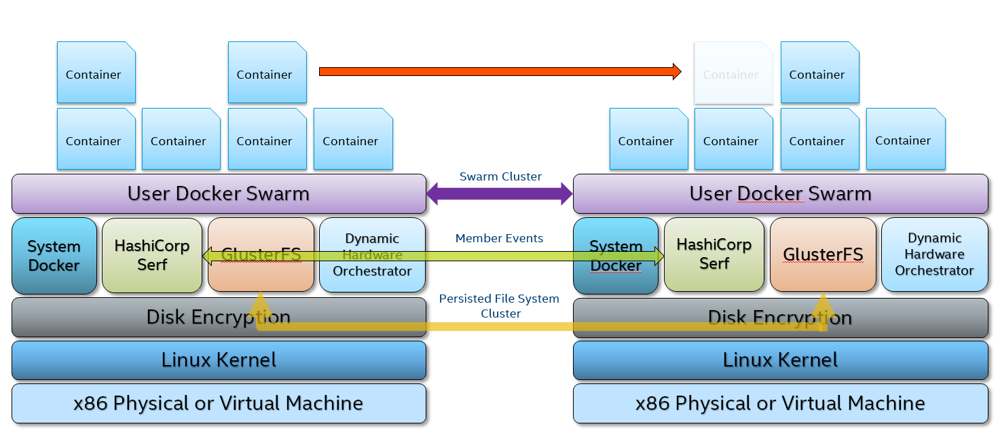

# Retail Workload Orchestrator (RWO)

1. [Overview](#overview)

1. [Architecture](#architecture)

1. [Prerequisites](#prerequisites)

1. [Quick Installation Guide](#quick-installation-guide)

1. [Production Installation Guide](#production-installation-guide)

## Overview
Retail Workload Orchestrator is a ZeroConfig Technology enable edge devices to scale like Lego blocks.  It is the set of open source services used to enable autonomous horizontally scaling of edge devices services to support Workload Orchestration.  As application workloads demand more resources, add Intel x86 hardware as Lego building blocks to the infrastructure.  Simply plug a machine into the network and walk away; the new system will auto configure itself, join the cluster and become an available resource for the application workloads.  This ZeroConfig architecture can provide high availability, distributed workloads, workload affinity to specific hardware, upgrade hardware with 24/7 uptime, and more.  The ZeroConfig architecture can simultaneously run Linux, Windows and Android applications across a heterogeneous infrastructure on Intel x86 Architecture from Celeron to Xeon in the same compute environment.

## Key Points
  * Scaling vertically can be very expensive, limiting and still be a single point of failure; instead scale horizontally and start with commodity hardware.
  * To scale horizontally on heterogeneous x86 hardware from Intel Celeron to Xeon.
  * To provide the ability to use existing hardware and provide a migration path to new hardware with near 100% uptime.
  * To provide high availability with heterogeneous x86 hardware.
  * To provide software abstraction from multiple nodes.

## Architecture



RWO version components:

  * Hashicorp Serf version 0.8.4
    * Device discovery and event driven orchestration
  * RedHat GlusterFS version 5.10
    * Persisted file storage
  * GlusterFS Plugin version 1.0
    * Docker volume plugin
  * Docker Swarm version 19.03.0
  * Dynamic Hardware Orchestrator
    * Dynamically discovers the state of the hardware or VM resources
  * Alpine Console
    * Management Console


## Prerequisites

  * x86 Hardware or x86 Virtual Machine
    * At Least 5 GB of Disk Space
	* 4 GB of RAM
  * Linux Distro that supports Docker
  * `docker` 18.06.x or greater
  * `docker-compose` v1.23.2 or greater
  * `bash` v4.3.48 or greater

*NOTE: SSH Service is not required as RWO will create one at Port 222. This value "PORT=(some alternate port number)", can be changed in /opt/rwo/compose/docker-compose.yml under the 'console:' service environment virables.  The option is to change the default Port number on the host.*

* For [Quick Installation Guide](#quick-installation-guide)
* For [Production Installation Guide](#production-installation-guide)
* *For detail build steps*. [See this](docs/01_Install.md)

## Quick Installation Guide

  1. ALL the following commands must run as ROOT.  Type `sudo su -` and the your password before proceeding.

  ```bash
  sudo su -
  ```

  2. Install Docker Compose

  ```bash
  mkdir -p /usr/local/bin
  wget -O /usr/local/bin/docker-compose "https://github.com/docker/compose/releases/download/1.24.0/docker-compose-$(uname -s)-$(uname -m)"
  chmod a+x /usr/local/bin/docker-compose
  ```
  
  3. Clone this project to /opt/rwo

  ```bash
  cd /opt
  git clone https://github.com/intel/RetailWorkloadOrchestrator.git rwo
  ```

  4. Build the container images

  ```bash
  cd /opt/rwo
  ./build.sh
  ```

  5. Install Demo Keys.  NOTE: These keys are published and should be used for demonstration purposes only.  Please refer to the [Production Installation Guide](#production-installation-guide) section to genereate unique keys.

  ```bash
  ./install.sh demo
  ```

  6. Start RWO

  ```bash
  systemctl start rwo
  ```

  7. Confirm all services are running. (It will take 2 minutes for all services to start)

  ```bash
  ~# docker ps
  CONTAINER ID        IMAGE                     COMMAND                  CREATED             STATUS              PORTS               NAMES
  d36940c44e3e        edge/console-alpine:1.0   "dumb-init /bin/init"    21 seconds ago      Up 20 seconds                           rwo_console_1
  253f6246488a        edge/serf:0.8.4           "/opt/rwo/serf/docke…"   22 seconds ago      Up 21 seconds                           rwo_serf-agent_1
  33034bedfce1        edge/glusterfs-rest:7     "dumb-init glusterd …"   22 seconds ago      Up 21 seconds                           rwo_gluster-server_1
  a9c3989f3dda        edge/glusterfs-rest:7     "dumb-init /bin/init…"   25 seconds ago      Up 24 seconds                           rwo_gluster-rest_1
  99ca764a1a5e        edge/app-docker:1.0       "app-docker.sh /usr/…"   26 seconds ago      Up 26 seconds                           rwo_app-docker_1
  3a7fddeed1e7        edge/rngd:1.0             "haveged -F"             26 seconds ago      Up 26 seconds                           rwo_rngd
  ```

  8. Enter the RWO Console

  ```bash
  docker exec -it rwo_console_1 bash
  ```

  9. Install Portainer.io Management.  NOTE:  The following command MUST run inside the RWO Console from step 8.
  
  ```bash
  curl -L https://downloads.portainer.io/portainer-agent-stack.yml -o portainer-agent-stack.yml
  docker stack deploy --compose-file=portainer-agent-stack.yml portainer
  ```

  10. Get the IP address of this node and connect to Portainer at `<IP Address>:9000`.  Create a username and password.  Once logged in, click the "Primary" endpoint below and go to the "Swarm" link on the left navigation panel.

  11. On another node repeat steps 1 through 7.  From Poratiner UI refresh the Swarm page to watch an aditional node be added.

## Production Installation Guide

  1. Clone this project to /opt/rwo
  ```bash
  cd /opt
  git clone https://github.com/intel/RetailWorkloadOrchestrator.git rwo
  ```

  2. Build the container images
  ```bash
  cd /opt/rwo
  ./build.sh
  ```

  3. Push all RWO images to your Docker Registry.
  ```
  edge/glusterfs-plugin
  edge/dxo
  edge/app-docker
  edge/dho
  edge/serf
  edge/glusterfs-rest
  edge/console-alpine
  ```

  4. Update compose/docker-compose.yml images to reflect your registry path.

  5. Genereate RWO Certifcates and Keys.  NOTE:  All Certifcates and Keys must be copied to all other nodes you plan to join this node. For more details, please refer to https://github.com/intel/RetailWorkloadOrchestrator/blob/master/docs/02_Security.md
  ```bash
  ./generate_keys.sh
  ```

  5. Install
  ```bash
  ./install.sh
  ```

  4. Start RWO
  ```bash
  systemctl start rwo
  ```

## Serf Encryption Keys

`Retail Workload Orchestrator` uses `hashicorp serf` for service discovery. Encryption with AES-256 is enabled for serf v0.8.4.

The AES-256 key is to be kept in a keyring file in json format.

*keyring.json*

```
[
  "HvY8ubRZMgafUOWvrOadwOckVa1wN3QWAo46FVKbVN8="
]
```

This is a symmetric key which needs to be same in all the nodes of a cluster, only then serf will be able to discover them.

For Details. [See this](docs/02_Security.md#serf-key).

## Security in `Retail Workload Orchestrator`

Security in `Retail Workload Orchestrator` is taken care of by using PKI architecture and root `privileges`. Various components of `Retail Workload Orchestrator` talk to each other either over `https` or they use docker-volumes/filesystem location protected by root privilege. `Glusterfs` is also secured using PKI.

For Details. [See this](docs/02_Security.md).

## Environment Variables

There are Environment variables defined in /opt/rwo/compose/docker-compose.yml. 

1. SWARM_RESTORE_TIME_IN_SECONDS : Number of seconds RWO handlers need to wait for a swarm restore to happen after a member leaves the cluster or reboot itself.
2. MEMBER_REBOOT_TIME_IN_SECONDS : Number of seconds RWO handlers need to wait for a member to complete its reboot.
3. LOG_LEVEL : Specifies different levels at which logs needs to be printed. 
   LOG_LEVEL=1 prints info level log statements. 
   LOG_LEVEL=2 prints debug level log statements.

## Known Limitations

  * Rarely `gluster` cluster formation may fail and node may not be able to join the cluster, in that case, go ahead run /opt/rwo/bin/reset and reboot.  Resetting RWO will wipe out all its state.
  * Dynamic Hardware Orchestrator (DHO) Currently only detects system state at startup.  Does not continuosly check state.
  

